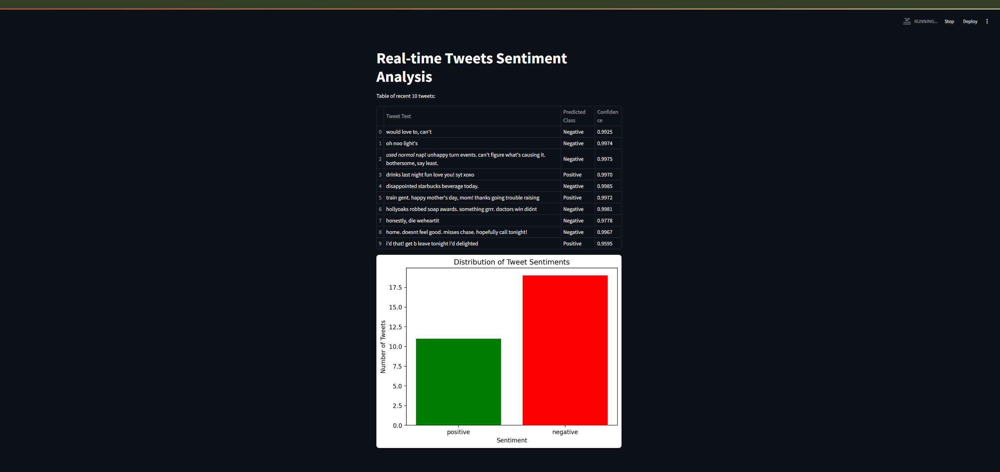

# Lab 1 (Kafka): Analyzing the Sentiment of Tweets using Kafka and Streamlit

## Project Description

The project is a system for analyzing the sentiment of tweets in real time settings. The data is transmitted through Apache Kafka, processed and classified, and the results are visualized using Streamlit.

## Project Structure
```
lab1-kafka/
├── assets/
├── backend/
│   ├── raw_data_producer.py
│   ├── data_preprocessing_consumer.py
│   └── classifier_consumer.py
├── data/
│   ├── sentiment140/
|   |   ├── training.1600000.processed.noemoticon.csv
│   |   ├── balanced_tweets_part1.csv
│   |   └── balanced_tweets_part2.csv
|   └── Exploratory_Data_Analysis.ipynb
├── model/ 
├── app.py
├── docker-compose.yml
├── requirements.txt
├── run_topics.sh
└── README.md

```
## Dataset an Model
[Sentiment140 Dataset](https://www.kaggle.com/datasets/kazanova/sentiment140)  was chosen for Sentiment Analysis. 
Sentiment140 dataset with 1.6 million tweets
This is the sentiment140 dataset. It contains 1,600,000 tweets extracted using the twitter api . The tweets have been annotated (0 = negative, 1 = positive) and they can be used to detect sentiment.

For more details, please refer to the dataset description and analysis in the Jupyter notebook located at: `data/Exploratory_Data_Analysis.ipynb`.

The model that is choden for sentiment analysis is [Sentiment140_roBERTa_5E](https://huggingface.co/pig4431/Sentiment140_roBERTa_5E).

## Project launch
1. Make sure that you have Docker and Docker Compose installed.
2. Clone the repository:
   ```bash
   git clone https://github.com/AlinaShapiro/lab1-kafka.git
   cd lab1-kafka

The code was tested on Windows 11 (through GitBash), with Venv Python 3.10.

3. Create and activate the virtual environment
```bash
python -m venv .venv
source .venv/bin/activate  # or .venv\Scripts\activate on Windows
```
4. Install dependencies
```bash
pip install -r requirements.txt
```
5. Run Docker Compose to start Kafka
```bash
docker-compose up
```
6. [Optional] Check the running containers
```bash
docker ps
```

7. Create topics in Kafka
```bash
chmod +x run_topics.sh
./run_topics.sh
```

8. In Seperate GitBash terminals run:

1st terminal: 
```bash
source .venv/bin/activate
python backend/raw_data_producer.py data/sentiment140/balanced_tweets_part1.csv --bootstrap_servers localhost:9095 --topic raw_data
```

2nd terminal: 
```bash
source .venv/bin/activate
python backend/raw_data_producer.py data/sentiment140/balanced_tweets_part2.csv --bootstrap_servers localhost:9095 --topic raw_data
```
3rd terminal: 
```bash
source .venv/bin/activate
python backend/data_preprocessing_consumer.py 
```

4th terminal: 
```bash
source .venv/bin/activate
python backend/classifier_consumer.py
```

5th terminal
Run the Streamlit app:

```bash
source .venv/bin/activate
streamlit run app.py
```
If where is an OSError conserning uavailability of port (given that it is currently not in use) try to find other ports. 

By Default one can now view your Streamlit app in your browser.
Local URL: http://localhost:8501

As a result, you should see the Real-Time Sentiment Analysis of Tweets displayed in a table (showing the 10 most recent tweets and their corresponding model predictions transmitted through Apache Kafka). Additionally, you will see statistics on the distribution of predicted tweet sentiments.


9. Shutting Down the Pipeline:
* Ensure all Python scripts and applications are terminated.

* Run the following command to stop and remove the Docker container along with their volumes:
```bash
docker-compose down -v
```